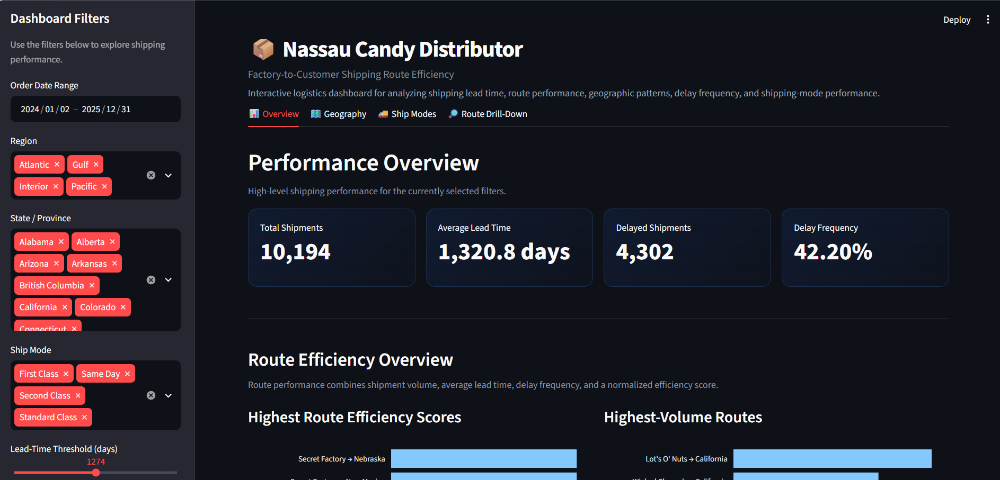

# Factory-to-Customer Shipping Route Efficiency Analysis

## 📦 Project Overview

This project analyzes factory-to-customer shipping performance for Nassau Candy Distributor using Python, Pandas, Plotly, and Streamlit.

The analysis focuses on shipping lead time, route efficiency, delays, geographic patterns, and shipping-mode performance to identify routes and locations that may require further operational investigation.

## 🎯 Business Problem

Nassau Candy Distributor ships products from multiple factories to customers across different U.S. regions and states.

The objective is to analyze:

- Shipping lead time
- Factory-to-customer route performance
- Delay frequency
- Regional and state-level patterns
- Shipping mode performance
- Route-level efficiency and variability

The analysis provides data-driven insights that can support logistics monitoring and operational decision-making.

## 📊 Dataset

The dataset contains **10,194 shipment records** with information including:

- Order and shipping dates
- Ship mode
- Customer location
- Region and state
- Product information
- Sales
- Units
- Gross profit
- Cost

Five factories were mapped to products to create factory-to-customer routes.

## 🔧 Data Preparation

The following steps were performed:

- Checked missing values
- Checked duplicate records
- Converted date columns to datetime format
- Calculated shipping lead time
- Mapped products to factories
- Created factory-to-customer routes
- Standardized geographic information
- Created delay indicators
- Calculated route-level performance metrics

The dataset's median shipping lead time of **1,274 days** was used as an analytical delay threshold. This is a project-specific analytical threshold and **not an official service-level agreement (SLA).**

## 📈 Analysis Performed

### Route Analysis

Routes were analyzed using:

- Shipment volume
- Average shipping lead time
- Lead-time variability
- Delay frequency
- Route efficiency score

### Geographic Analysis

The project examines:

- Regional shipping performance
- State-level lead times
- High-volume destinations
- Locations with higher observed delay frequencies

### Ship Mode Analysis

Shipping modes were compared using:

- Average lead time
- Delay frequency
- Sales
- Cost
- Gross profit

## 🔑 Key Metrics

| Metric | Value |
|---|---:|
| Total Shipments | 10,194 |
| Average Lead Time | 1,320.8 days |
| Median Lead Time | 1,274 days |
| Delayed Shipments | 4,302 |
| Delay Frequency | 42.20% |
| Unique Routes | 196 |
| Factories | 5 |
| Products | 15 |

## 🖥️ Streamlit Dashboard

The project includes an interactive Streamlit dashboard with four sections:

- 📊 Overview
- 🗺️ Geography
- 🚚 Ship Modes
- 🔎 Route Drill-Down

The dashboard provides interactive filters for:

- Region
- State
- Ship mode
- Lead-time threshold
- Order date

### Dashboard Preview



## 🛠️ Technologies Used

- Python
- Pandas
- NumPy
- Plotly
- Streamlit
- Jupyter Notebook
- GitHub

## 📁 Project Structure

```text
Nassau-Candy-Shipping-Route-Analysis/
│
├── app.py
├── dashboard_data.csv
├── requirements.txt
├── README.md
├── .gitignore
└── images/
    └── dashboard_screenshot.png

### Executive Summary
[View Executive Summary (PDF)](executive_summary.pdf)
